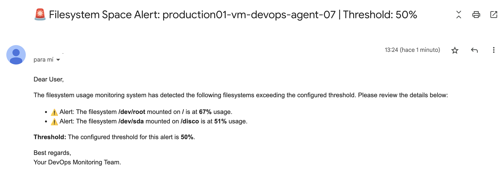
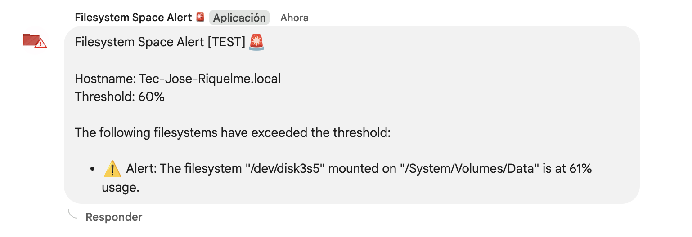

# **Filesystem Monitor Space**

## **Overview**

**Filesystem Monitor Space** is a simple and efficient application developed in Node.js, designed to monitor disk usage on Linux systems. It sends alerts via email and/or a Google Chat webhook when the usage of any monitored filesystem exceeds a configured threshold. Additionally, it can be combined with cron or other scheduling tools to run automatically at defined intervals.

## **Notification Examples**

### **Email**

The system sends detailed email alerts with information about the filesystems that have exceeded the configured threshold.



### **Google Chat**

You can also receive alerts directly in Google Chat by integrating the webhook provided by the service.



---

## **Prerequisites**

- **Node.js**: Version 18 or higher.
- **SMTP Server**: Required for sending email alerts (optional if you only use Google Chat).
- **Google Chat Webhook**: Required to integrate notifications into Google Chat (optional if you only use email).

---

## **Installation and Usage**

### **1. Clone the Repository**

```bash
git clone git@github.com:haulmer/filesystem-monitor-space.git
```

### **2. Access the Project Directory**

```bash
cd filesystem-monitor-space
```

### **3. Install Dependencies**

```bash
npm install
```

### **4. Configure Environment Variables**

- Create a `.env` file in the project’s root directory.
- Use `example.env` as a reference to define the required variables:

```env
# Monitoring Configuration
THRESHOLD=           # Disk usage threshold percentage to trigger alerts (default value: 75)
EXCLUDE_LIST=        # List of filesystems to exclude from monitoring (format: filesystem1|filesystem2)

# SMTP Configuration (optional if you only use Google Chat)
SMTP_HOST=           # SMTP server
SMTP_PORT=           # SMTP server port
SMTP_USER=           # User for SMTP server authentication
SMTP_PASS=           # Password for SMTP server authentication
MAIL_TO=             # Email address to send alerts

# Google Chat Configuration (optional if you only use email)
GCHAT_WEBHOOK_URL=   # Webhook URL provided by Google Chat
```

### **5. Run the Program**

```bash
node src/app.js
```